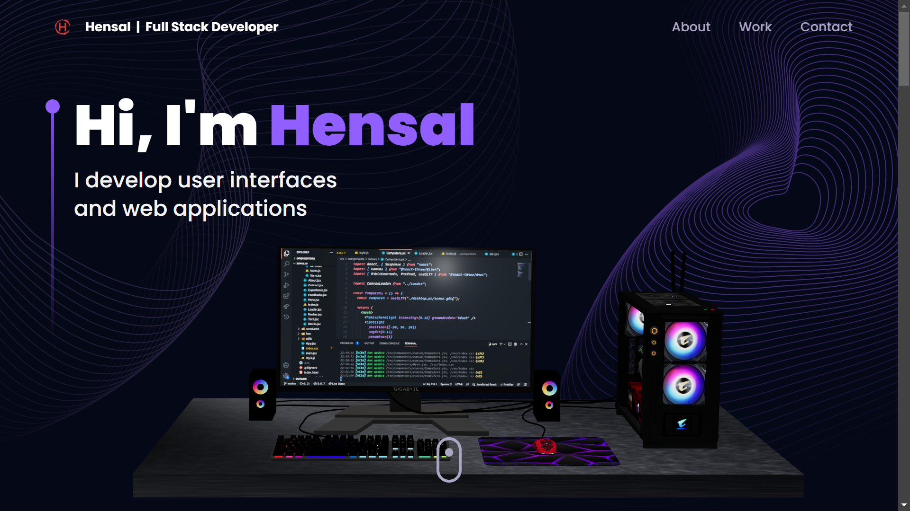

# Hensal Deon Portfolio

A modern, responsive developer portfolio built with React, Vite, Tailwind CSS, and Three.js. The site presents professional experience, technical skills, selected projects, and a contact flow through an animated, interactive web experience.



## Table of Contents

- [Overview](#overview)
- [Features](#features)
- [Tech Stack](#tech-stack)
- [Project Structure](#project-structure)
- [Getting Started](#getting-started)
- [Environment Variables](#environment-variables)
- [Available Scripts](#available-scripts)
- [Customization](#customization)
- [Deployment](#deployment)
- [Acknowledgements](#acknowledgements)
- [Contact](#contact)

## Overview

This portfolio is designed to showcase frontend engineering work through a polished single-page experience. It includes a 3D hero scene, professional timeline, technology showcase, project carousel, and EmailJS-powered contact form.

## Features

- Interactive 3D hero and background visuals using Three.js and React Three Fiber.
- Responsive layout optimized for desktop, tablet, and mobile screens.
- Animated page sections powered by Framer Motion.
- Work experience timeline with company branding and role highlights.
- Project carousel with live links, technology tags, and visual previews.
- Contact form with Formik validation, Yup schema checks, EmailJS integration, and toast feedback.
- Centralized content management through reusable constants and asset exports.

## Tech Stack

| Category | Technologies |
| --- | --- |
| Frontend | React 18, Vite, React Router |
| Styling | Tailwind CSS, PostCSS, Autoprefixer |
| 3D & Motion | Three.js, React Three Fiber, Drei, Framer Motion, Maath, React Tilt |
| Forms | Formik, Yup, EmailJS, React Hot Toast |
| UI Components | Swiper, React Vertical Timeline Component |
| Tooling | ESLint, npm |

## Project Structure

```bash
.
├── public/
│   ├── desktop_pc/          # 3D desktop model assets
│   └── planet/              # 3D planet model assets
├── readme_asset/            # README preview assets
├── src/
│   ├── assets/              # Images, icons, logos, and tech assets
│   ├── components/          # Reusable UI sections and layout components
│   ├── components/canvas/   # Three.js canvas components
│   ├── constants/           # Navigation, skills, experience, and project data
│   ├── hoc/                 # Section wrapper utilities
│   ├── hooks/               # Reusable React hooks
│   ├── utils/               # Animation and validation helpers
│   ├── App.jsx
│   ├── index.css
│   ├── main.jsx
│   └── styles.js
├── index.html
├── package.json
├── tailwind.config.js
└── vite.config.js
```

## Getting Started

### Prerequisites

- Node.js 18 or later
- npm

### Installation

Clone the repository:

```bash
git clone https://github.com/HensalDeon/react_portfolio.git
cd react_portfolio
```

Install dependencies:

```bash
npm install --legacy-peer-deps
```

Start the development server:

```bash
npm run dev
```

The app runs locally at:

```bash
http://localhost:3000
```

## Environment Variables

The contact form uses EmailJS. Create a `.env` file in the project root and add the following values:

```bash
VITE_APP_EMAILJS_SERVICE_ID=your_emailjs_service_id
VITE_APP_EMAILJS_TEMPLATE_ID=your_emailjs_template_id
VITE_APP_EMAILJS_PUBLIC_KEY=your_emailjs_public_key
```

Keep `.env` files private and do not commit production credentials.

## Available Scripts

```bash
npm run dev
```

Starts the Vite development server.

```bash
npm run build
```

Creates an optimized production build in the `dist/` directory.

```bash
npm run preview
```

Serves the production build locally for review.

```bash
npm run lint
```

Runs ESLint across the project.

## Customization

- Update personal details, roles, technologies, experience, and projects in `src/constants/index.js`.
- Add or replace images, logos, project thumbnails, and technology icons in `src/assets/`.
- Adjust colors, shadows, breakpoints, and background images in `tailwind.config.js`.
- Modify page sections in `src/components/`.
- Update 3D scenes in `src/components/canvas/` and model files in `public/`.

## Deployment

Build the project before deployment:

```bash
npm run build
```

Deploy the generated `dist/` folder to a static hosting provider such as Vercel, Netlify, or GitHub Pages.

## Acknowledgements

- [EmailJS](https://www.emailjs.com/)
- [Framer Motion](https://www.framer.com/motion/)
- [React Three Fiber](https://docs.pmnd.rs/react-three-fiber)
- [Three.js](https://threejs.org/)
- [React Tilt](https://www.npmjs.com/package/react-tilt)
- [React Vertical Timeline Component](https://www.npmjs.com/package/react-vertical-timeline-component)
- JavaScript Mastery for the original 3D portfolio inspiration.

## Contact

Hensal Deon

- [LinkedIn](https://www.linkedin.com/in/hensal-deon-472883227/)
- [GitHub Repository](https://github.com/HensalDeon/react_portfolio)
